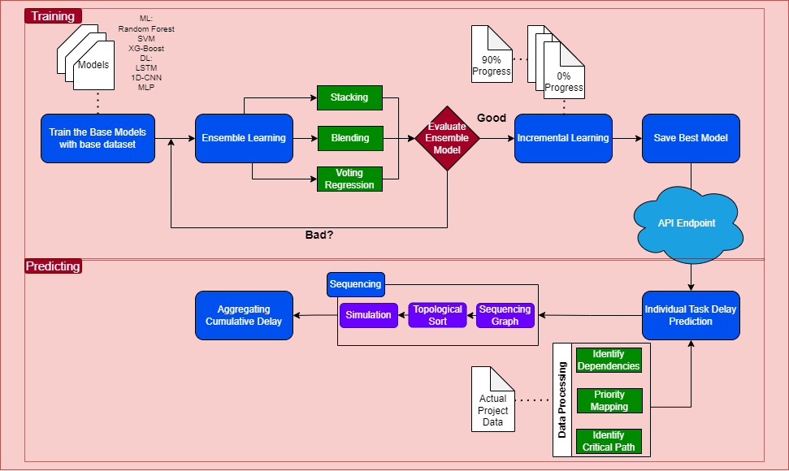

# Method Delay Prediction

## Objective
The Method app aims to reduce delays in construction projects through effective project management software. The solution involves developing an AI-based system to predict potential delays in current or future tasks/projects, enabling users to make informed decisions and reduce overall delays.

## General Workflow
1. Initialize database environment
2. Populate database with dummy data
3. Simulate project and task progression until completion
4. Collect data from simulation and track delay
5. Preprocess and clean data
6. Develop AI-based prediction model
7. Fine-tune to achieve better performance
8. Integrate with Method App

## Database Environment
*Important: The repository uses a local SQL Server connection. For other connections, please adjust accordingly.*

### Tables
- **Project**: Project Information
- **Task**: Task Information
- **User**: User identity, contact, and role information
- **Trade**: List of available trades
- **Role**: List of available roles
- **Weather**: Table for storing weather information

### Functions
- **GetAdjustedEndDate**: Calculates the end date of the project based on its workday pattern.
  - Params: `startdate` (date), `duration` (int), `workday` (int)
- **GetWorkDayPattern**: Retrieves the workday pattern of the project.
  - Params: `projectID` (int)

The workday pattern is an int denoting when the project will work in a week using binary conventions.
- e.g. 31: 11111 (Mon, Tue, Wed, Thu, Fri)
- e.g. 127: 1111111 (Whole week is a workday)
- e.g. 123: 1111011 (Whole week but Fri is not a workday)
- e.g. 63: 1111110 (Mon to Sat is a workday)

## Repository Structure
- **Config.yaml**: Config file for data generation and simulation for project progression.
- **data/**: Directory for all generated and simulated data.
  - **{number of project}_{start date year}/**: Contains all relevant CSV files for each project instance.
    - **Task.csv**: List of tasks.
    - **Project.csv**: List of projects.
    - **Project_report.csv**: Project data after simulation.
    - **Task_report.csv**: Task data after simulation.
    - **Project_data.csv**: Project data after cleaning.
    - **Task_data.csv**: Task data after cleaning.
    - **Project_train.csv**: Raw data for training.
    - **Task_train.csv**: Raw data for training.
- **model/**: Directory for all saved models.
  - Models are saved using H2O and named in the format `{number of project}_{start date year}_{training in minutes}`.
  - Refer to **fine_tune.ipynb** for the workflow.
- **src/**: Directory for all scripts.
  - **generate.py**: Generates task and project data from the config file, uses SQL connection, and saves data.
  - **initDB.sql**: Initializes the database environment based on the connected DB.
  - **restartDB.sql**: SQL script to restart the DB, cleaning everything.
  - **restart.py**: Restarts the entire environment (generated data on DB will be lost).
  - **project.py**: Project class for data generation.
  - **user.py**: User class for data generation.
  - **utils.py**: Utility functions.
  - **simulate.py**: Simulates all projects until completion, then saves the report.
  - **preprocess.py**: Preprocesses the simulated data for model development.
- **Run_all.ps1**: Shell script to run everything from data generation to simulation and save the data. The input is the config file, and the output is stored in the data/ directory.
- **endpoint.py**: Flask endpoint for the model.
- **Endpoint_test.ipynb**: Checks the endpoint connection locally.
- **fine_tune.ipynb**: Fine-tunes the task delay prediction model using H2O.
- **streamlit.py**: Streamlit interface for testing and evaluation. Input the directory name to start.
- **Tomorrow_api.ipynb**: Demonstrates using the weather API. For the API token, login to Tomorrow.io, then ask the relevant owner for credentials and get the API key from the API management.

## Usage
1. Complete the `config.yaml` file.
2. Run `run_all.ps1` and check the `data/` directory for the result.
3. To verify, run `streamlit run streamlit.py` to open the interface and input the data folder name.
4. To activate the endpoint for testing purposes, run `python endpoint.py`.
5. To check Tomorrow API connection, refer to `tomorrrow_api.ipynb`.

## Requirements
- Python 3.11
- Install dependencies: `pip install -r requirements.txt`

## Contact
For permission and transfer access to the GitHub repository, contact: fadhilumar.af@gmail.com

## June~September Progress
- Adjust Feature Engineering
- Use new dummy data inside data/New_Dummy folder
- To pre-process & train the data please open **Tinkering_model.ipynb**
- For Project progress, please check Method_progress ppt file

## Method Pipeline

## Database Environment Adjustment
*Important: For my case i used local SQL (SQL Workbench) for stoing data, so i changed some syntaxes. For other connections & platform, please adjust accordingly.*

## Docker Endpoint image
- Please create virtual environment first, please use **Python 3.12++**
- Copy **endpoint2.py**, **utility.py**, **Dockerfile** (you can modify this fle however you want), **requirements_env.txt** , **data_env** folder & **model** folder to your virtual environment folder
- Install python dependencies from **requirements_env.txt** inside your vitual environment
- Run Docker build to create the image to be deployed
- To test the endpoint please use **endpoint_test.ipynb** file

